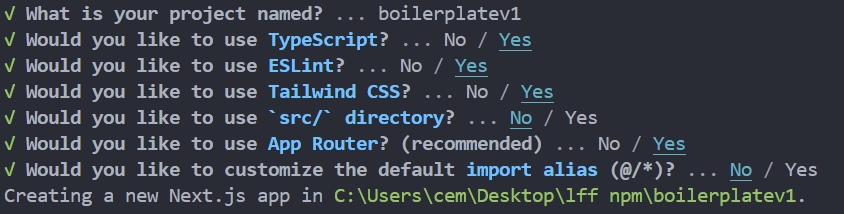
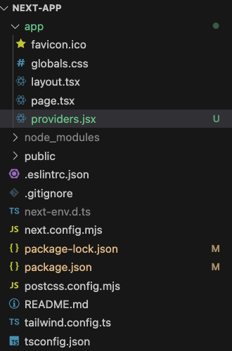
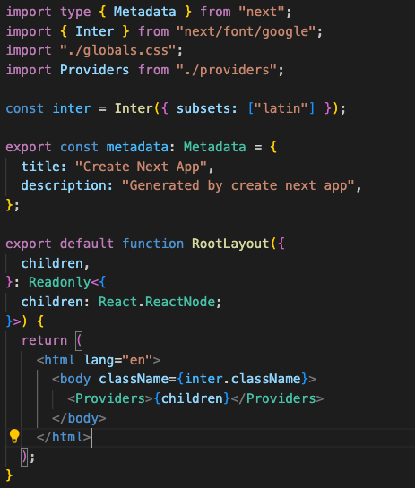

# Next JS Implementation

Install latest Next JS version

```jsx
npx create-next-app@latest
```

For the demonstration we used the following values:




Install littlefish npm package

```jsx
npm install littlefish-nft-auth-framework
```

In your app directory create a “providers.jsx” file.




```jsx
"use client"
import { WalletProvider} from 'littlefish-nft-auth-framework';

export default function Providers({children}) {
  return (
    <WalletProvider>
      {children}
    </WalletProvider>
  )
};
```

In your “app/layout.tsx” file import the Providers and wrap your {children} around the wallet provider.




Now you are ready to use the package.

# React App Implementation

Create a React project.

```jsx
npx create-react-app <YOUR-APP-NAME>
```

Then, install littlefish-nft-auth-framework package.

```jsx
npm install littlefish-nft-auth-framework
```

After installing the package, go to src/ directory and index.js file and add the provider like this:

```jsx
import React from 'react';
import ReactDOM from 'react-dom/client';
import './index.css';
import App from './App';
import reportWebVitals from './reportWebVitals';
import { WalletProvider } from 'littlefish-nft-auth-framework';

const root = ReactDOM.createRoot(document.getElementById('root'));
root.render(
  <WalletProvider>
    <React.StrictMode>
      <App />
    </React.StrictMode>
  </WalletProvider>
);

reportWebVitals();

```

Now you are ready to use the package.

## Returned Values and Function Descriptions

### Hooks

- **`useWallet()`**
  - **Returns**: An object containing:
    - `isConnected` (`boolean`): Indicates if a wallet is currently connected.
    - `wallets` (`Array<string>`): List of detected wallet identifiers.
    - `connectedWalletId` (`string|null`): Identifier of the currently connected wallet.
    - `assets` (`Array<Array<string, string, number>>`): Decoded assets from the connected wallet, each represented as `[policyID, assetName, amount]`.

### Provider Component

- **`WalletProvider`**
  - **Purpose**: Provides wallet context to all child components in the application, allowing them access to wallet data and functions.

### Utility Functions

- **`connectWallet(walletName: string)`**
  - **Returns**: `Promise<void>`
  - **Description**: Attempts to connect to the specified wallet and updates the context with wallet details if successful. The function is asynchronous and resolves without returning any specific data.

- **`disconnectWallet()`**
  - **Returns**: `void`
  - **Description**: Resets connection-related state variables to reflect no active wallet connection. Does not return any data.

- **`decodeHexToAscii(processedArray: Array)`**
  - **Returns**: `Array<Array<string>>`
  - **Description**: Converts hex-encoded assetName strings within the processed array into ASCII strings. Returns an array with elements formatted as [policyID, assetName, amount].


## Example Usage

The only difference between NextJS and React App usage is, when using NextJS, you need to use **"use client"** on the beginning of the pages you want to use **littlefish-nft-auth-framework** package.

First you need to import the **useWallet** hook to your component.

```jsx
import { useWallet } from "littlefish-nft-auth-framework";
```

Use the '**useWallet()**' hook inside your component to get access to several properties and methods such as **isConnected**, **wallets**, **assets**, and functions like **connectWallet**, 00disconnectWallet**, and **decodeHexToAscii**.
```jsx
  isConnected,
  connectWallet,
  disconnectWallet,
  wallets,
  assets,
  decodeHexToAscii,
} = useWallet();
```

### Wallet Connect

Here is an example of connecting wallet. The wallets array will be displayed to give the user the option which wallet they want to connect.
```jsx
wallets.map((wallet, index) => (
  <a key={index} onClick={() => connectWallet(wallet)}>{wallet}</a>
))

```

After the wallet connection, these will be updated:
- isConnected: It will be **True**
- assets: If there are any assets in the wallet, this will be an array of arrays.

### Wallet Disconnect
In order to disconnect wallet:

```jsx
<a onClick={() => disconnectWallet()}>Disconnect Wallet</a>
```
This action will update:
- isConnected to **False**.
- assets to an empty array.

### Displaying Assets

In order to display asset information and use **decodeHexToAscii** function, we initialized these states:
```jsx
const [walletAssets, setWalletAssets] = useState("");
const [isHex, setIsHex] = useState(true);

useEffect(() => {
  setWalletAssets(assets || []);
}, [assets]);
```

Here is how the **decodeHexToAscii** function updates **walletAssets** state:
```jsx
{isHex ? 
  <a onClick={() => {setWalletAssets(decodeHexToAscii(walletAssets)); setIsHex(false)}}>Decode Hex to Ascii</a> : 
  <a onClick={() => {setWalletAssets(assets); setIsHex(true)}}>Show Hex</a>
}

```

Displaying the assets:
```jsx
walletAssets.map((item, index) => (
  <pre key={index}>PolicyID: {item[0]}, Name: {item[1]}, Amount: {item[2]}</pre>
))

```